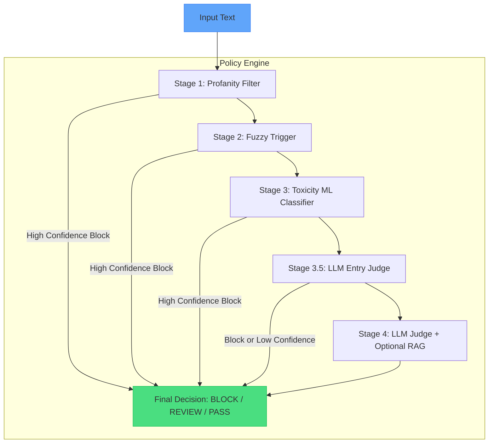

# Lexicont: lightweight policy driven agent for text moderation


Lexicont is a moderation system built as a **policy-driven agent** that combines fast rule-based filters, machine learning, and LLM reasoning. It processes the majority of inputs in milliseconds and only invokes the LLM when confidence is low, making it suitable for production environments where low latency is required.

## Overview
- Fast layers - profanity detection, fuzzy matching, toxicity ML - run quickly.
- Early stop - high-confidence blocks skip further processing.
- LLM layers - intermediate triage and final judgment with Qwen via llamacpp or Ollama.
- RAG support - Qdrant vector database for retrieving similar examples.
- Policy driven agent - explicit control loop ensures predictable behaviour.

## How It Works

The system uses a strictly linear pipeline with configurable early exits:



## Architecture
The moderation pipeline follows a fixed order of stages:

1. profanity_filter - dictionary + leetspeak detection
2. fuzzy_trigger - partial ratio matching
3. toxicity_ml - multilingual toxicity classifier
4. llm_entry_judge - LLM for text normalisation and decision on stage 4
5. llm_judge - final LLM with RAG

**Control logic:**
- After stage 1 or stage 2, if confidence >= 0.85 and decision is block, the pipeline stops.
- Stage 4 is invoked only if either the triage layer (stage 3.5) explicitly allows it, or triage is disabled and max confidence < 0.80.

## Quick Start

### 1. Local installation with Poetry

```bash
git clone https://github.com/corefrg/lexicont.git
cd lexicont
poetry install
```

Test it immediately:

```bash
poetry run lexicont check "buy fake documents through traffic police"
```

### 2. Run LLM backend (required for LLM stages)

**Option A - Ollama (easiest)**

```bash
ollama serve          # in one terminal
ollama pull qwen3:4b  # in another terminal
```

**Option B - llama.cpp (more control, works great on CPU)**

```bash
# Example with quantized model
./llama-server -m Qwen_Qwen3-4B-Q4_K_M.gguf \
  --host 0.0.0.0 \
  --port 11434 \
  -c 4096 \
  --threads 12 \
  -ngl 0
```

### 3. Docker Compose (full stack)

```bash
docker-compose up -d
```

Test the API:

```bash
curl -X POST http://localhost:8000/moderate \
  -H "Content-Type: application/json" \
  -d '{"text":"buy fake documents"}'
```

## Usage

### Command line

```bash
# Legacy syntax
poetry run lexicont "text to moderate"

# New explicit command
poetry run lexicont check "text to moderate"

# With debug output
poetry run lexicont check "text" --log-level DEBUG --verbose

# Interactive mode
poetry run lexicont
```

### HTTP API

Start the server:

```bash
poetry run uvicorn lexicont.api:app --host 0.0.0.0 --port 8000
```

Endpoints:
- `POST /moderate` - returns decision, confidence, and stage details
- `GET /health` - status check

### From Python

```python
from lexicont.pipeline import run

result = run("your text here")
print(result.final_decision)   # block, review or pass
print(result.max_confidence)
print(result.explanation)
```

## Configuration

### Create your own configuration files

```bash
poetry run lexicont init --dir my_configs
```

Then set environment variables so the library uses your files:

```bash
# Windows
set LEXICONT_CONFIG=my_configs\moderation_config.yaml
set LEXICONT_RULES=my_configs\moderation_rules.v1.yaml
set LEXICONT_PATTERNS=my_configs\patterns.jsonl

# Linux / macOS
export LEXICONT_CONFIG=my_configs/moderation_config.yaml
export LEXICONT_RULES=my_configs/moderation_rules.v1.yaml
export LEXICONT_PATTERNS=my_configs/patterns.jsonl
```

### Main configuration files

| File                     | Purpose                                           | Environment Variable   |
|--------------------------|---------------------------------------------------|------------------------|
| moderation_config.yaml   | Thresholds, stage toggles, LLM settings, RAG      | LEXICONT_CONFIG        |
| moderation_rules.v1.yaml | Custom phrase lists for profanity and fuzzy       | LEXICONT_RULES         |
| patterns.jsonl           | Examples for RAG semantic search                  | LEXICONT_PATTERNS      |

Each file has built-in defaults. You can override them with your own files.

### Important options in moderation_config.yaml

- `general.early_stop_confidence` - threshold for early termination (default 0.85)
- `general.stage4_trigger_confidence` - when to call final LLM (default 0.80)
- `general.enable_stage1/2/3` - toggle individual stages
- `enable_llm_entry_judge` / `enable_llm_judge` - enable/disable LLM layers
- `llm_judge.backend` - `llamacpp` or `ollama`
- `llm_judge.rag.enabled` - turn RAG on or off

### moderation_rules.v1.yaml example
```yaml
categories:
  profanity:
    - fuck you
  illegal:
    - buy fake license
```

### patterns.jsonl example (one JSON per line)
```json
{"text": "buy a license through traffic police", "label": "offer to buy forged documents", "category": "illegal"}
```

## Development
```bash
poetry install
pre-commit install
ruff format src tests
ruff check --fix src tests
```

To add a new filter, implement a function in the `filters/` directory and register it in `agent.py`.

## License
MIT
